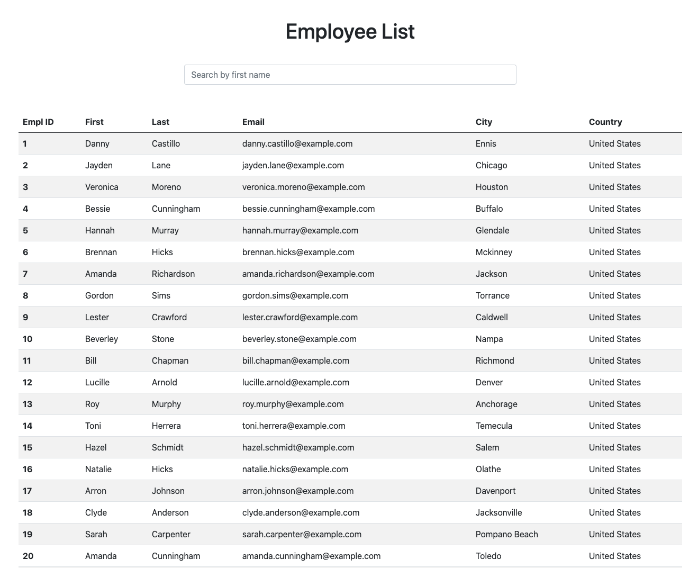

# React Employee Directory

## Description

The purpose of this application is to use React to create class-based components to display an employee directory table.

## Functionality

* User can search for employees by first name.
* User can sort the first name field alphabetically by clicking the column header.

## Key NPM Packages Used
* react
* axios
* react-router-dom

## Live App

This app is deployed through GitHub page [here](https://mrpancakes.github.io/react-employee-directory/).

